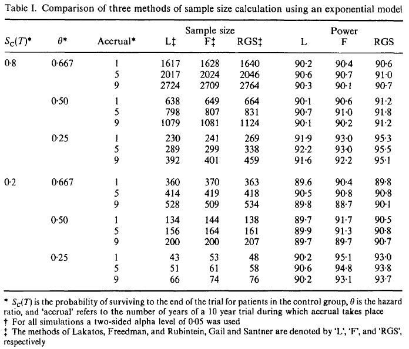

## Motivations 

- Comparer les différentes méthodes de calcul de sample size
- Montrer que la méthode de Lakatos (co-auteur) est mieux.

## Méthodes comparées

- ### Rubinstein, Gail et Santner (RGS)
- ### Freedman
- ### Lakatos

## Rubinstein, Gail et Santner (RGS)

Méthode par "formule", proche de Schoenfeld, mais ici on ne dit pas comment on calcul le nombre d'évènements mais directement le sample size

$$
N = \frac{(z_{\alpha} + z_{\beta})^2}{\log(\text{HR})^2}*\rho
$$

## Freedman

Autre méthode par "formule", avec un calcul explicit du nombre d'évènements.

$$
N = (z_{\alpha} + z_{\beta})^2* \frac{1 + \text{HR}}{(1 - \text{HR})^2}*\rho
$$

## Lakatos

Non détaillée dans l'article car beaucoup plus complexe. 
_"using a discrete non-stationary Markov process"_

. . .

Lakatos, E. "Sample sizes based on the log-rank statistic in complex clinical trials", _Biometrics, **44**, 229-241 (1988)

## Comparaisons

Les méthodes sont comparés dans 3 cas : 

 - ::: {.fragment .highlight-red}
Survie suivant une loi exponentielle
:::
 - Survie non-exponentielle mais avec risque proportionnel
- Risque non-proportionnel

## {.smaller}

### Résultats 

::: {.column width="70%"}

:::

::: {.smaller .column width="30%"}
- Les 3 méthodes donnent des résultats assez similaires.
- La méthode de Lakatos donne un sample size plus petit.
- Même si l'écart est minime, Lakatos est plus souvent en dessous de la puissance demandée de 0.8 (5 fois).
:::

## Conclusions

- La méthode de Lakatos fonctionne dans un cadre plus large
- Il peut il y avoir de légère différence de sample size en fonction des méthodes
- Dans notre cas ces différences sont minimes et ne justifie pas des écarts de 20% de samples size dans les cas pertinents. 

