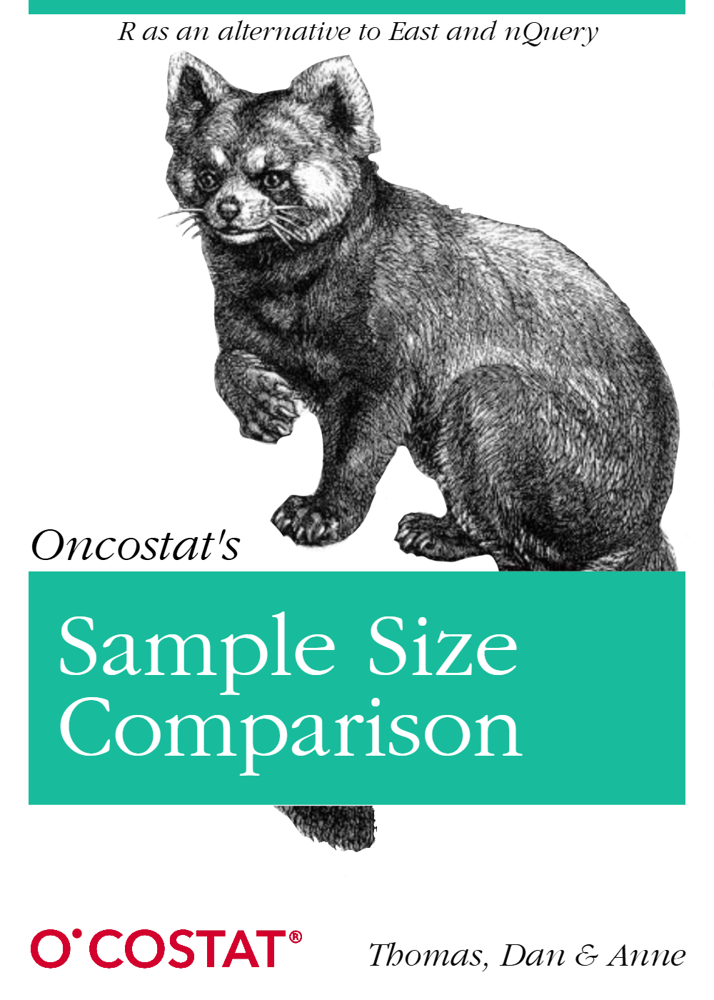

::: {.columns}

::: {.column width="60%"}
**Welcome** to the website dedicated to presenting the results of the *Sample Size Comparison* project.
This site brings together several complementary sections designed to guide you through the work:

- [**Book**](index.qmd) — the core of the project, where each study design is documented with its methodology, assumptions, and comparative results.
- [**Interactive**](site-files/interactive/interactive.qmd) — dynamic visualisations that allow you to explore the results in more detail, adjust parameters, and better understand how sample size choices influence performance.
- **More** — additional material related to the main topic, including slides and side analyses.
- [**Code**](site-files/explain-code/code-home.qmd) — a transparent view into the full computational workflow, from simulation engines to plotting functions, ensuring reproducibility and openness.

Together, these sections provide a unified space to navigate the project, understand the methodological insights, and interact directly with the underlying analyses.
:::

::: {.column width="40%"}

  

:::

:::

## Results summary

Below is a concise overview of the main findings from the *Sample Size Comparison* project.  
This summary is intended for readers who want the key takeaways without exploring the full “Book” section.

The table compares, for each endpoint and design type, the statistical test used, and how well the implemented R calculations matched the software(East or nQuery) reference values. 

| Endpoints | Design type                   | Test         | R/Software matching |
| :-------- | :---------------------------- | :----------- | :------------------ |
| survival  | 2‑Arm fixed design            | Log‑rank     | 🟢 Perfect          |
| survival  | 2‑Arm group‑sequential design | Log‑rank     | 🟡 Good             |
| survival  | 1‑Arm fixed design            | Log‑rank     | 🔵 Poor             |
| Binary    | 2‑Arm fixed design            | Exact        | 🟡 Good             |
| Binary    | 2‑Arm fixed design            | Z‑Pooled     | 🟢 Perfect          |
| Binary    | 2‑Arm group‑sequential design | Z‑Pooled     | 🟢 Perfect          |
| Binary    | 1‑Arm fixed design            | Exact        | 🟡 Good             |
| Binary    | 1‑Arm fixed design            | 1‑Arm Z test | 🟢 Perfect          |

## Additional content:

::: {#sample-listings}
:::

